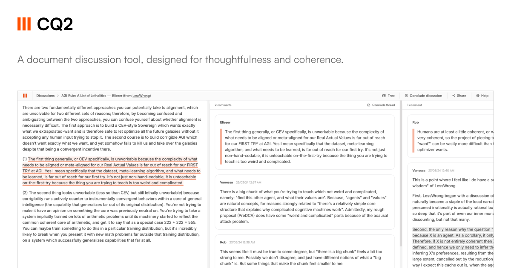

## Introduction

CQ2 is the free and open source tool for complex discussions. Learn more [here](https://cq2.co).

## Motivation

There are no chat/forum platforms built for complex discussions.

Discussions using existing platforms often turn into a mess of sub-discussions around quotes. People talk over one another and topics get mixed up. You're forced to mentally manage who quoted what from where.

Meetings are hit-or-miss. When it comes to complex and lengthy discussions, they often go nowhere. Many meetings benefit from taking a break to analyse deeper or reflect further, but there is never enough time.

CQ2's unique sliding panes design with quote-level and n-level threads helps you hyper-focus on one thing at a time. No more losing context. No more copy-pasting quotes.

## How to use

Create a new discussion in CQ2 — give a title, a short/long description about the discussion and your name. No login required. Share the link with the participants to invite them.

General messages about the discussion and their replies go in the main/first thread. To reply to a particular quote from the main description or from any message, select the text and click on the popped-up button to create a new, focused thread and reply there.You can reply to a whole message as well, instead of a particular quote, by using the button on the top-right of the message. Click on a highlighted text to open its corresponding thread.

## Get in touch

If you have suggestions for how CQ2 could be improved, please add your thoughts on a relevant discussion [here](https://github.com/cq2-co/cq2/discussions/) or start a new discussion. If you have any questions, we would love to hear them too! If you want to report an issue, check if the issue is already opened [here](https://github.com/cq2-co/cq2/issues) otherwise open a new one.

## Self-hosting

### Docker

Coming soon!

### Vercel and MongoDB Atlas

CQ2 is built with MongoDB and Next.js, so for a quick and free setup, you can use a free MongoDB Atlas cluster and Vercel's hobby plan.

You can get started with MongoDB Atlas for free [here](https://www.mongodb.com/basics/mongodb-atlas-tutorial). Make sure to add all IP addresses (0.0.0.0/0) to the IP access list of your Atlas cluster since it is not possible to determine the IP addresses of Vercel deployments.

You can get started with Vercel's hobby plan for free:

1. Fork this repo to your own GitHub account
2. Go to https://vercel.com/dashboard
3. Create a new project
4. Import your forked repository
5. Set the environment variables (according to the instructions in .env.example)
6. Deploy

## Contributing

### Development

First, make sure you have [Node.js](https://nodejs.org/en/) and [MongoDB](https://www.mongodb.com/docs/manual/installation/#mongodb-installation-tutorials) installed. Then, to develop locally:

1. Fork this repo to your own GitHub account and then clone it.

   ```sh
   git clone https://github.com/<your-username>/CQ2.git
   ```

2. Go to the project folder

   ```sh
   cd CQ2
   ```

3. Create a new branch:

   ```sh
   git checkout -b MY_BRANCH_NAME
   ```

4. Install the dependencies with:

   ```sh
   npm i
   ```

5. Copy `.env.example` to `.env`

   ```sh
   cp .env.example .env
   ```

6. Set the env variables according to the instructions in the .env file

7. Start developing and watch for code changes:

   ```sh
   npm run dev
   ```

8. Please make sure that you can make a full production build before opening a PR. You can build the project with:

   ```sh
   npm run build
   ```

## License

CQ2 is distributed under the AGPLv3 [license](https://github.com/cq2-co/cq2/blob/main/LICENSE).
