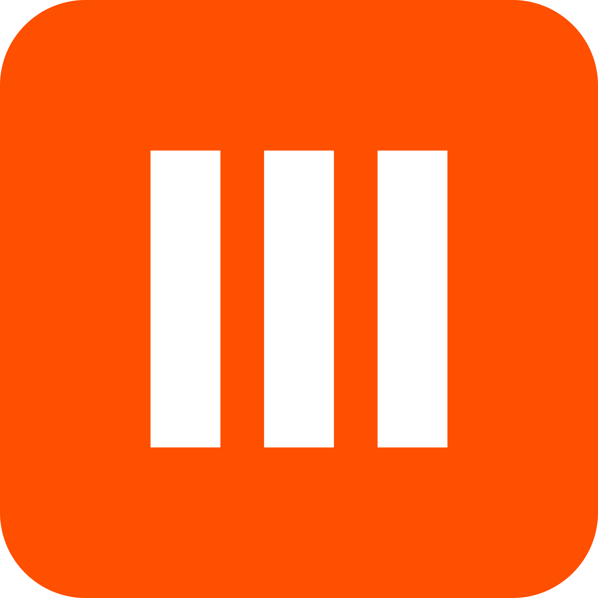
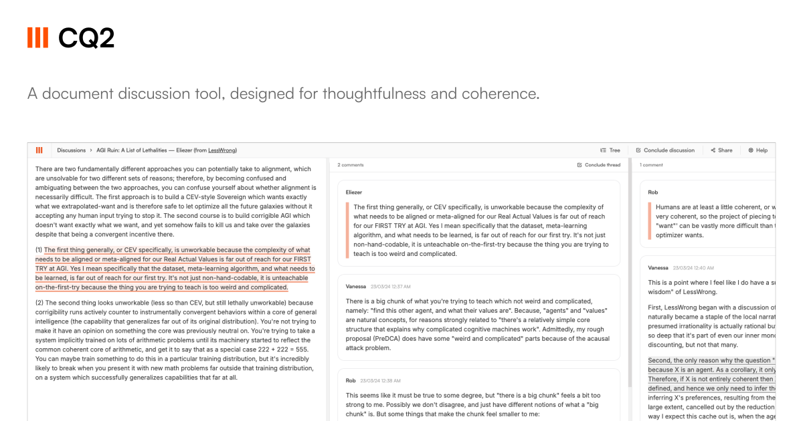

CQ2 is a tool for RFCs, designed for thoughtfulness and coherence. [Learn more](https://cq2.vercel.app).

> [!NOTE]
> If you want to self-host, contribute or discuss about CQ2, contact us [here](mailto:hi@anandbaburajan.com).

## License

CQ2 is distributed under the AGPLv3 [license](https://github.com/anandbaburajan/cq2/blob/main/LICENSE).
